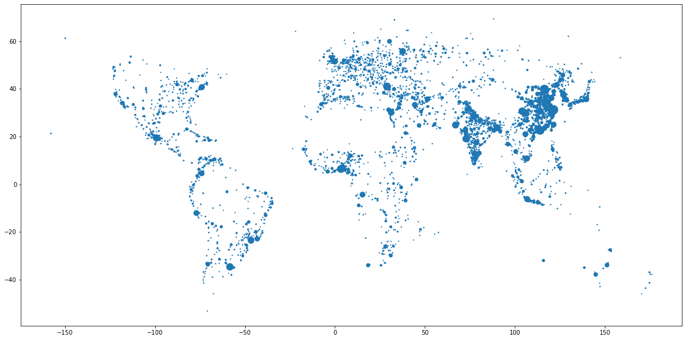
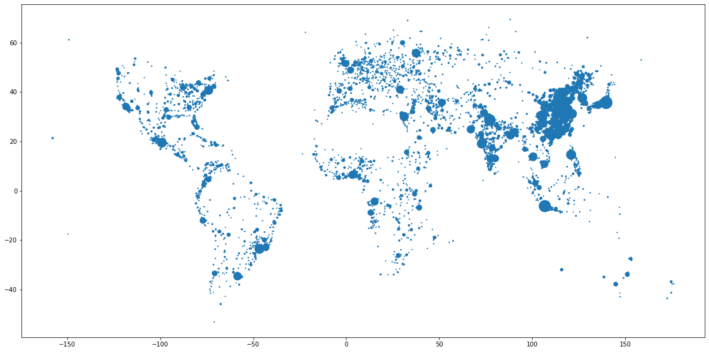

I recently came accross this blog article ["Cities with Nice Weather"](https://jdonland.github.io/city_temperatures/index.html) by ***Jesse Onland***.

He explains his approach on how to find the best city, in terms of average and variance in temperature.

His analysis is excellent, well written and organized, but the data he used is far from being exhaustive. Indeed, the [list he got from Wikipedia](https://en.wikipedia.org/wiki/List_of_cities_by_average_temperature) only shows temperature data for major cities, so he might be missing some his dream city, just because it's not populated enough...

Also, the list provides temperature data only, no information aboud wind speed and relative humidity, which are two important factors influcencing the perceived temperature.

We can do better 😎


```python
%matplotlib inline
import matplotlib.pyplot as plt
import numpy as np
import pandas as pd
import pycountry_convert as pc

plt.rcParams["figure.facecolor"] = (1.0, 1.0, 1.0, 1)
plt.rcParams["figure.figsize"] = [20, 10]
```

## First step: get data for cities population


```python
dataset_1 = pd.read_csv(r"./data/geonames-all-cities-with-a-population-1000.csv", sep=";", na_filter=False)
dataset_2 = pd.read_csv(r"./data/simplemaps_worldcities_basicv1.75.csv", sep=",", na_filter=False)
# We need to set na_filter=False since pandas will convert country code "NA" for Namibia as NaN...
```


```python
dataset_1.head()
```


<div>
<style scoped>
    .dataframe tbody tr th:only-of-type {
        vertical-align: middle;
    }

    .dataframe tbody tr th {
        vertical-align: top;
    }

    .dataframe thead th {
        text-align: right;
    }
</style>
<table border="1" class="dataframe">
  <thead>
    <tr style="text-align: right;">
      <th></th>
      <th>Geoname ID</th>
      <th>Name</th>
      <th>ASCII Name</th>
      <th>Alternate Names</th>
      <th>Feature Class</th>
      <th>Feature Code</th>
      <th>Country Code</th>
      <th>Country name EN</th>
      <th>Country Code 2</th>
      <th>Admin1 Code</th>
      <th>Admin2 Code</th>
      <th>Admin3 Code</th>
      <th>Admin4 Code</th>
      <th>population</th>
      <th>Elevation</th>
      <th>DIgital Elevation Model</th>
      <th>Timezone</th>
      <th>Modification date</th>
      <th>LABEL EN</th>
      <th>Coordinates</th>
    </tr>
  </thead>
  <tbody>
    <tr>
      <th>0</th>
      <td>8396129</td>
      <td>Sanjiang</td>
      <td>Sanjiang</td>
      <td>Sanjiang,Sanjiang Jiedao,Sanjiang Qu,san jiang...</td>
      <td>P</td>
      <td>PPLA3</td>
      <td>CN</td>
      <td>China</td>
      <td></td>
      <td>01</td>
      <td>3402</td>
      <td></td>
      <td></td>
      <td>0</td>
      <td></td>
      <td>14</td>
      <td>Asia/Shanghai</td>
      <td>2021-09-19</td>
      <td>China</td>
      <td>31.34813,118.36132</td>
    </tr>
    <tr>
      <th>1</th>
      <td>8405692</td>
      <td>Xinmin</td>
      <td>Xinmin</td>
      <td>Xinmin,Xinmin Zhen,xin min,xin min zhen,新民,新民镇</td>
      <td>P</td>
      <td>PPLA4</td>
      <td>CN</td>
      <td>China</td>
      <td></td>
      <td>33</td>
      <td>8739734</td>
      <td></td>
      <td></td>
      <td>28033</td>
      <td></td>
      <td>402</td>
      <td>Asia/Shanghai</td>
      <td>2022-04-12</td>
      <td>China</td>
      <td>30.39759,107.3895</td>
    </tr>
    <tr>
      <th>2</th>
      <td>8416824</td>
      <td>Jindaoxia</td>
      <td>Jindaoxia</td>
      <td>Jindaoxia,Jindaoxia Zhen,jin dao xia,jin dao x...</td>
      <td>P</td>
      <td>PPLA4</td>
      <td>CN</td>
      <td>China</td>
      <td></td>
      <td>33</td>
      <td>8739734</td>
      <td></td>
      <td></td>
      <td>13752</td>
      <td></td>
      <td>323</td>
      <td>Asia/Shanghai</td>
      <td>2022-04-01</td>
      <td>China</td>
      <td>30.00528,106.65187</td>
    </tr>
    <tr>
      <th>3</th>
      <td>8420197</td>
      <td>Jianlong</td>
      <td>Jianlong</td>
      <td>Jianlong,Jianlong Xiang,jian long,jian long xi...</td>
      <td>P</td>
      <td>PPLA4</td>
      <td>CN</td>
      <td>China</td>
      <td></td>
      <td>33</td>
      <td>8739734</td>
      <td></td>
      <td></td>
      <td>18151</td>
      <td></td>
      <td>276</td>
      <td>Asia/Shanghai</td>
      <td>2022-04-01</td>
      <td>China</td>
      <td>29.3586,106.18522</td>
    </tr>
    <tr>
      <th>4</th>
      <td>8505210</td>
      <td>Jianhua</td>
      <td>Jianhua</td>
      <td>Bukui,Bukui Jiedao,Jianhua,Jianhua Qu,bo kui,b...</td>
      <td>P</td>
      <td>PPLA3</td>
      <td>CN</td>
      <td>China</td>
      <td></td>
      <td>08</td>
      <td>2302</td>
      <td></td>
      <td></td>
      <td>0</td>
      <td></td>
      <td>146</td>
      <td>Asia/Shanghai</td>
      <td>2022-03-12</td>
      <td>China</td>
      <td>47.35773,123.95977</td>
    </tr>
  </tbody>
</table>
</div>


```python
dataset_1.drop(
    columns=[
        "Geoname ID",
        "Feature Class",
        "Feature Code",
        "Admin1 Code",
        "Admin2 Code",
        "Admin3 Code",
        "Admin4 Code",
        "Elevation",
        "DIgital Elevation Model",
        "Modification date",
    ],
    inplace=True,
)
```


```python
dataset_1["Coordinates"] = dataset_1["Coordinates"].astype("string")
dataset_1[["lat", "lng"]] = dataset_1["Coordinates"].str.split(pat=",", n=1, expand=True)
dataset_1["lat"] = dataset_1["lat"].astype(float)
dataset_1["lng"] = dataset_1["lng"].astype(float)
```


```python
dataset_2.head()
```


<div>
<style scoped>
    .dataframe tbody tr th:only-of-type {
        vertical-align: middle;
    }

    .dataframe tbody tr th {
        vertical-align: top;
    }

    .dataframe thead th {
        text-align: right;
    }
</style>
<table border="1" class="dataframe">
  <thead>
    <tr style="text-align: right;">
      <th></th>
      <th>city</th>
      <th>city_ascii</th>
      <th>lat</th>
      <th>lng</th>
      <th>country</th>
      <th>iso2</th>
      <th>iso3</th>
      <th>admin_name</th>
      <th>capital</th>
      <th>population</th>
      <th>id</th>
    </tr>
  </thead>
  <tbody>
    <tr>
      <th>0</th>
      <td>Tokyo</td>
      <td>Tokyo</td>
      <td>35.6839</td>
      <td>139.7744</td>
      <td>Japan</td>
      <td>JP</td>
      <td>JPN</td>
      <td>Tōkyō</td>
      <td>primary</td>
      <td>39105000</td>
      <td>1392685764</td>
    </tr>
    <tr>
      <th>1</th>
      <td>Jakarta</td>
      <td>Jakarta</td>
      <td>-6.2146</td>
      <td>106.8451</td>
      <td>Indonesia</td>
      <td>ID</td>
      <td>IDN</td>
      <td>Jakarta</td>
      <td>primary</td>
      <td>35362000</td>
      <td>1360771077</td>
    </tr>
    <tr>
      <th>2</th>
      <td>Delhi</td>
      <td>Delhi</td>
      <td>28.6667</td>
      <td>77.2167</td>
      <td>India</td>
      <td>IN</td>
      <td>IND</td>
      <td>Delhi</td>
      <td>admin</td>
      <td>31870000</td>
      <td>1356872604</td>
    </tr>
    <tr>
      <th>3</th>
      <td>Manila</td>
      <td>Manila</td>
      <td>14.6000</td>
      <td>120.9833</td>
      <td>Philippines</td>
      <td>PH</td>
      <td>PHL</td>
      <td>Manila</td>
      <td>primary</td>
      <td>23971000</td>
      <td>1608618140</td>
    </tr>
    <tr>
      <th>4</th>
      <td>São Paulo</td>
      <td>Sao Paulo</td>
      <td>-23.5504</td>
      <td>-46.6339</td>
      <td>Brazil</td>
      <td>BR</td>
      <td>BRA</td>
      <td>São Paulo</td>
      <td>admin</td>
      <td>22495000</td>
      <td>1076532519</td>
    </tr>
  </tbody>
</table>
</div>


```python
dataset_2.drop(columns=["capital", "id"], inplace=True)
```


```python
dataset_2 = dataset_2[dataset_2["population"].str.isnumeric()]
dataset_2["population"] = dataset_2["population"].astype(int)
```


```python
dataset_1.query("population >= 100000", inplace=True)
dataset_2.query("population >= 100000", inplace=True)
```


```python
print(dataset_1.shape, dataset_2.shape)
```

    (4690, 12) (4943, 9)
    

Let's see the data for my (small) city in France:


```python
dataset_1.query("`Country Code` == 'FR' and Name == 'Brest'")
```


<div>
<style scoped>
    .dataframe tbody tr th:only-of-type {
        vertical-align: middle;
    }

    .dataframe tbody tr th {
        vertical-align: top;
    }

    .dataframe thead th {
        text-align: right;
    }
</style>
<table border="1" class="dataframe">
  <thead>
    <tr style="text-align: right;">
      <th></th>
      <th>Name</th>
      <th>ASCII Name</th>
      <th>Alternate Names</th>
      <th>Country Code</th>
      <th>Country name EN</th>
      <th>Country Code 2</th>
      <th>population</th>
      <th>Timezone</th>
      <th>LABEL EN</th>
      <th>Coordinates</th>
      <th>lat</th>
      <th>lng</th>
    </tr>
  </thead>
  <tbody>
    <tr>
      <th>139736</th>
      <td>Brest</td>
      <td>Brest</td>
      <td>BES,Brest,Brestia,Bresto,braista,bu lei si te,...</td>
      <td>FR</td>
      <td>France</td>
      <td></td>
      <td>144899</td>
      <td>Europe/Paris</td>
      <td>France</td>
      <td>48.39029,-4.48628</td>
      <td>48.39029</td>
      <td>-4.48628</td>
    </tr>
  </tbody>
</table>
</div>


```python
dataset_2.query("`country` == 'France' and city == 'Brest'")
```


<div>
<style scoped>
    .dataframe tbody tr th:only-of-type {
        vertical-align: middle;
    }

    .dataframe tbody tr th {
        vertical-align: top;
    }

    .dataframe thead th {
        text-align: right;
    }
</style>
<table border="1" class="dataframe">
  <thead>
    <tr style="text-align: right;">
      <th></th>
      <th>city</th>
      <th>city_ascii</th>
      <th>lat</th>
      <th>lng</th>
      <th>country</th>
      <th>iso2</th>
      <th>iso3</th>
      <th>admin_name</th>
      <th>population</th>
    </tr>
  </thead>
  <tbody>
    <tr>
      <th>3759</th>
      <td>Brest</td>
      <td>Brest</td>
      <td>48.39</td>
      <td>-4.49</td>
      <td>France</td>
      <td>FR</td>
      <td>FRA</td>
      <td>Bretagne</td>
      <td>139602</td>
    </tr>
  </tbody>
</table>
</div>


Seems accurate!

Let's see for Tokyo:


```python
dataset_1.query("`Country Code` == 'JP' and Name == 'Tokyo'")
```


<div>
<style scoped>
    .dataframe tbody tr th:only-of-type {
        vertical-align: middle;
    }

    .dataframe tbody tr th {
        vertical-align: top;
    }

    .dataframe thead th {
        text-align: right;
    }
</style>
<table border="1" class="dataframe">
  <thead>
    <tr style="text-align: right;">
      <th></th>
      <th>Name</th>
      <th>ASCII Name</th>
      <th>Alternate Names</th>
      <th>Country Code</th>
      <th>Country name EN</th>
      <th>Country Code 2</th>
      <th>population</th>
      <th>Timezone</th>
      <th>LABEL EN</th>
      <th>Coordinates</th>
      <th>lat</th>
      <th>lng</th>
    </tr>
  </thead>
  <tbody>
    <tr>
      <th>33145</th>
      <td>Tokyo</td>
      <td>Tokyo</td>
      <td>Edo,TYO,Tochiu,Tocio,Tokija,Tokijas,Tokio,Toki...</td>
      <td>JP</td>
      <td>Japan</td>
      <td></td>
      <td>8336599</td>
      <td>Asia/Tokyo</td>
      <td>Japan</td>
      <td>35.6895,139.69171</td>
      <td>35.6895</td>
      <td>139.69171</td>
    </tr>
  </tbody>
</table>
</div>


```python
dataset_2.query("`country` == 'Japan' and city == 'Tokyo'")
```


<div>
<style scoped>
    .dataframe tbody tr th:only-of-type {
        vertical-align: middle;
    }

    .dataframe tbody tr th {
        vertical-align: top;
    }

    .dataframe thead th {
        text-align: right;
    }
</style>
<table border="1" class="dataframe">
  <thead>
    <tr style="text-align: right;">
      <th></th>
      <th>city</th>
      <th>city_ascii</th>
      <th>lat</th>
      <th>lng</th>
      <th>country</th>
      <th>iso2</th>
      <th>iso3</th>
      <th>admin_name</th>
      <th>population</th>
    </tr>
  </thead>
  <tbody>
    <tr>
      <th>0</th>
      <td>Tokyo</td>
      <td>Tokyo</td>
      <td>35.6839</td>
      <td>139.7744</td>
      <td>Japan</td>
      <td>JP</td>
      <td>JPN</td>
      <td>Tōkyō</td>
      <td>39105000</td>
    </tr>
  </tbody>
</table>
</div>


As you can see, there's a huge difference in terms of population size.

Looks like the `dataset_1` considers the 23 wards that made up the boundaries of the historic city of Tokyo, while `dataset_2` considers the greater Tokyo metropolitan area, which is spread over 3 prefectures...

Last check with Manila, capital city of the Philippines:


```python
dataset_1.query("`Country Code` == 'PH' and Name == 'Manila'")
```


<div>
<style scoped>
    .dataframe tbody tr th:only-of-type {
        vertical-align: middle;
    }

    .dataframe tbody tr th {
        vertical-align: top;
    }

    .dataframe thead th {
        text-align: right;
    }
</style>
<table border="1" class="dataframe">
  <thead>
    <tr style="text-align: right;">
      <th></th>
      <th>Name</th>
      <th>ASCII Name</th>
      <th>Alternate Names</th>
      <th>Country Code</th>
      <th>Country name EN</th>
      <th>Country Code 2</th>
      <th>population</th>
      <th>Timezone</th>
      <th>LABEL EN</th>
      <th>Coordinates</th>
      <th>lat</th>
      <th>lng</th>
    </tr>
  </thead>
  <tbody>
    <tr>
      <th>16765</th>
      <td>Manila</td>
      <td>Manila</td>
      <td>City of Manila,Dakbayan sa Manila,Lungsod ng M...</td>
      <td>PH</td>
      <td>Philippines</td>
      <td></td>
      <td>1600000</td>
      <td>Asia/Manila</td>
      <td>Philippines</td>
      <td>14.6042,120.9822</td>
      <td>14.6042</td>
      <td>120.9822</td>
    </tr>
  </tbody>
</table>
</div>


```python
dataset_2.query("`country` == 'Philippines' and city == 'Manila'")
```


<div>
<style scoped>
    .dataframe tbody tr th:only-of-type {
        vertical-align: middle;
    }

    .dataframe tbody tr th {
        vertical-align: top;
    }

    .dataframe thead th {
        text-align: right;
    }
</style>
<table border="1" class="dataframe">
  <thead>
    <tr style="text-align: right;">
      <th></th>
      <th>city</th>
      <th>city_ascii</th>
      <th>lat</th>
      <th>lng</th>
      <th>country</th>
      <th>iso2</th>
      <th>iso3</th>
      <th>admin_name</th>
      <th>population</th>
    </tr>
  </thead>
  <tbody>
    <tr>
      <th>3</th>
      <td>Manila</td>
      <td>Manila</td>
      <td>14.6</td>
      <td>120.9833</td>
      <td>Philippines</td>
      <td>PH</td>
      <td>PHL</td>
      <td>Manila</td>
      <td>23971000</td>
    </tr>
  </tbody>
</table>
</div>


Same issue: `dataset_1` considers the Manila city, while `dataset_2` gives data for the larger urban area of Metro Manila.


```python
dataset_1.query("`Country Code` == 'SG' and Name == 'Singapore'")
```


<div>
<style scoped>
    .dataframe tbody tr th:only-of-type {
        vertical-align: middle;
    }

    .dataframe tbody tr th {
        vertical-align: top;
    }

    .dataframe thead th {
        text-align: right;
    }
</style>
<table border="1" class="dataframe">
  <thead>
    <tr style="text-align: right;">
      <th></th>
      <th>Name</th>
      <th>ASCII Name</th>
      <th>Alternate Names</th>
      <th>Country Code</th>
      <th>Country name EN</th>
      <th>Country Code 2</th>
      <th>population</th>
      <th>Timezone</th>
      <th>LABEL EN</th>
      <th>Coordinates</th>
      <th>lat</th>
      <th>lng</th>
    </tr>
  </thead>
  <tbody>
    <tr>
      <th>9440</th>
      <td>Singapore</td>
      <td>Singapore</td>
      <td>SIN,Sin-ka-po,Singapore,Singapore City,Singapo...</td>
      <td>SG</td>
      <td>Singapore</td>
      <td></td>
      <td>3547809</td>
      <td>Asia/Singapore</td>
      <td>Singapore</td>
      <td>1.28967,103.85007</td>
      <td>1.28967</td>
      <td>103.85007</td>
    </tr>
  </tbody>
</table>
</div>


```python
dataset_2.query("`country` == 'Singapore'")
```


<div>
<style scoped>
    .dataframe tbody tr th:only-of-type {
        vertical-align: middle;
    }

    .dataframe tbody tr th {
        vertical-align: top;
    }

    .dataframe thead th {
        text-align: right;
    }
</style>
<table border="1" class="dataframe">
  <thead>
    <tr style="text-align: right;">
      <th></th>
      <th>city</th>
      <th>city_ascii</th>
      <th>lat</th>
      <th>lng</th>
      <th>country</th>
      <th>iso2</th>
      <th>iso3</th>
      <th>admin_name</th>
      <th>population</th>
    </tr>
  </thead>
  <tbody>
    <tr>
      <th>135</th>
      <td>Singapore</td>
      <td>Singapore</td>
      <td>1.3</td>
      <td>103.8</td>
      <td>Singapore</td>
      <td>SG</td>
      <td>SGP</td>
      <td>Central Singapore</td>
      <td>5271000</td>
    </tr>
  </tbody>
</table>
</div>


Both dataset seem outdated since Singapore current population is 6M, for both the country and the city.

Some data visualization would help to see if some cities/countries/continents are missing:


```python
plt.scatter(x=dataset_1["lng"], y=dataset_1["lat"], s=dataset_1["population"] / 1e5)
plt.show()
```


    

    


```python
plt.scatter(x=dataset_2["lng"], y=dataset_2["lat"], s=dataset_2["population"] / 1e5)
plt.show()
```


    

    


People sure like living near the sea!

Since both dataset seem accurate enouth, from now on we'll just keep the first dataset.


```python
df = dataset_1
print(df.shape)
df.head()
```

    (4690, 12)
    


<div>
<style scoped>
    .dataframe tbody tr th:only-of-type {
        vertical-align: middle;
    }

    .dataframe tbody tr th {
        vertical-align: top;
    }

    .dataframe thead th {
        text-align: right;
    }
</style>
<table border="1" class="dataframe">
  <thead>
    <tr style="text-align: right;">
      <th></th>
      <th>Name</th>
      <th>ASCII Name</th>
      <th>Alternate Names</th>
      <th>Country Code</th>
      <th>Country name EN</th>
      <th>Country Code 2</th>
      <th>population</th>
      <th>Timezone</th>
      <th>LABEL EN</th>
      <th>Coordinates</th>
      <th>lat</th>
      <th>lng</th>
    </tr>
  </thead>
  <tbody>
    <tr>
      <th>75</th>
      <td>Manzanillo</td>
      <td>Manzanillo</td>
      <td>MZO,Mansanil'o,Mansaniljas,Manzanillo,Manzanil...</td>
      <td>CU</td>
      <td>Cuba</td>
      <td></td>
      <td>128188</td>
      <td>America/Havana</td>
      <td>Cuba</td>
      <td>20.34173,-77.12126</td>
      <td>20.34173</td>
      <td>-77.12126</td>
    </tr>
    <tr>
      <th>128</th>
      <td>Augsburg</td>
      <td>Augsburg</td>
      <td>AGY,Agsborg,Aounksmpournk,Augsberg,Augsboerj,A...</td>
      <td>DE</td>
      <td>Germany</td>
      <td></td>
      <td>259196</td>
      <td>Europe/Berlin</td>
      <td>Germany</td>
      <td>48.37154,10.89851</td>
      <td>48.37154</td>
      <td>10.89851</td>
    </tr>
    <tr>
      <th>177</th>
      <td>Tébessa</td>
      <td>Tebessa</td>
      <td>TEE,Tebesa,Tebessa,Theveste,Tibissa,Tébessa,ta...</td>
      <td>DZ</td>
      <td>Algeria</td>
      <td></td>
      <td>634332</td>
      <td>Africa/Algiers</td>
      <td>Algeria</td>
      <td>35.40417,8.12417</td>
      <td>35.40417</td>
      <td>8.12417</td>
    </tr>
    <tr>
      <th>178</th>
      <td>Khenchela</td>
      <td>Khenchela</td>
      <td>Khenchela,Krenchela,QKJ,khnshlt,خنشلة</td>
      <td>DZ</td>
      <td>Algeria</td>
      <td></td>
      <td>117000</td>
      <td>Africa/Algiers</td>
      <td>Algeria</td>
      <td>35.43583,7.14333</td>
      <td>35.43583</td>
      <td>7.14333</td>
    </tr>
    <tr>
      <th>180</th>
      <td>Guelma</td>
      <td>Guelma</td>
      <td>Calama,Galma,Gel'ma,Gelma,Guelma,Kalima,QGE,ga...</td>
      <td>DZ</td>
      <td>Algeria</td>
      <td></td>
      <td>123590</td>
      <td>Africa/Algiers</td>
      <td>Algeria</td>
      <td>36.46214,7.42608</td>
      <td>36.46214</td>
      <td>7.42608</td>
    </tr>
  </tbody>
</table>
</div>


## Intermediate (facultative) step: filter cities by interest

I'd like to remove countries/continents that are not for me.

We first add a column for continent code:


```python
df["Country Code"] = df["Country Code"].astype("string")
df.query("`Country Code` != 'TL'", inplace=True)  # Remove Timor-Leste, not supported by pycountry
df.query("`Country Code` != 'EH'", inplace=True)  # Remove Western Sahara, not supported by pycountry
df["Continent Code"] = df.apply(lambda row: pc.country_alpha2_to_continent_code(row["Country Code"]), axis=1)
```


```python
df["Continent Code"].value_counts()
```


    AS    2155
    EU     866
    NA     627
    AF     552
    SA     459
    OC      29
    Name: Continent Code, dtype: int64


| Continent Code | Continent          |
|:--:|---------------|
| AS | Asia          |
| EU | Europe        |
| NA | North America |
| AF | Africa        |
| SA | South America |
| OC | Oceania       |
| AN | Antartica     |

## Second step: get historial weather data

We now need some historical weather data.

As explained earlier, we can't use [this list](https://en.wikipedia.org/wiki/List_of_cities_by_average_temperature) since it only contains data for "big" cities.


```python

```
